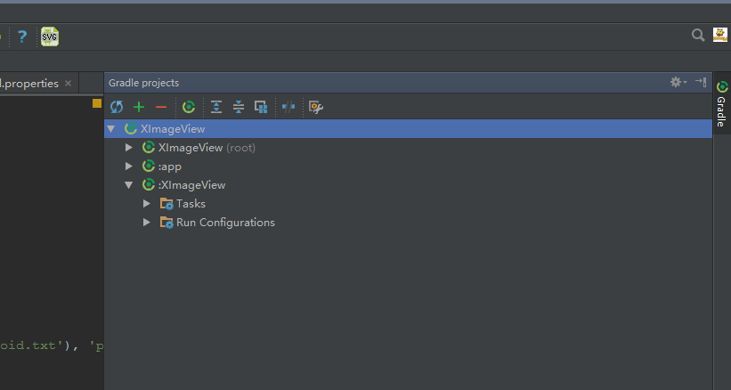
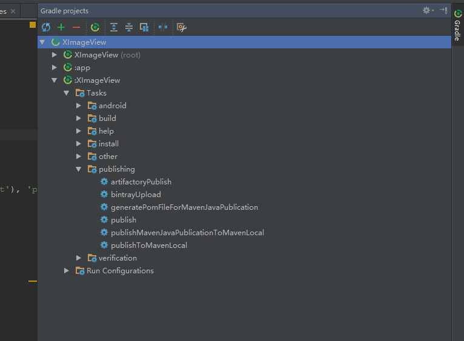
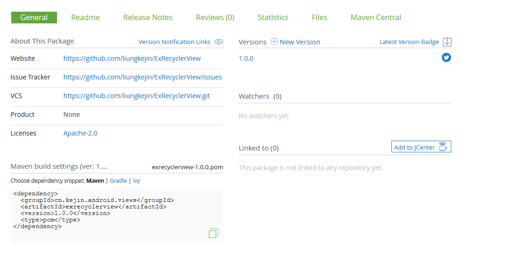

# Public Kotlin / Java Library to MavenCentral/JCenter

本文针对的是使用 Android Studio & Gradle 来发布 Java/Kotlin Android 库到 MavenCentral/JCenter,
对于 Java 库或者其他 IDE 没有实际检验过, 但是还是可以提供一个参考

本文假设你已经有了 [https://bintray.com] 的账号

## Java Library

[Example: XImageView](https://github.com/liungkejin/XImageView)

### 第一步
复制`java-bintray.gradle`到你的库目录下, 并在你的库目录(`/proj/lib/`)下的 `build.gradle` 里面添加:

```groovy
buildscript {
    repositories {
        mavenCentral()
        jcenter()
    }

    dependencies {
        classpath 'com.jfrog.bintray.gradle:gradle-bintray-plugin:1.6'
        classpath "org.jfrog.buildinfo:build-info-extractor-gradle:3.2.0"
    }
}

repositories {
    mavenCentral()
    jcenter()
}

apply from: 'java-bintray.gradle'
```

### 第二步
在你的工程目录(`/proj/`)下的 `local.properties` 里面添加你的 bintray 账户信息(记得要将这个文件加入到.gitingore)

```
bintray.user=xxx
bintray.apikey=xxxxxxxxxxxxxxxxxxxxxxxxxxxxxxxxxxxxx
```

在你的工程目录(`/proj/`)下的 `gradle.properties` 里面添加, 将值修改为自己库的信息

```
# 库的报名
PROJ_GROUP=cn.kejin.android.views
# 库的ID
PROJ_ARTIFACTID=XImageView
# 库的版本
PROJ_VERSION=1.0.2
### 最后 gradle引用的形式就是 $PROJ_GROUP:$PROJ_ARTIFACTID:$PROJ_VERSION

# 库名
PROJ_NAME=XImageView
# 库的项目主页
PROJ_WEBSITEURL=https://github.com/liungkejin/XImageView
# 问题跟踪地址
PROJ_ISSUETRACKERURL=https://github.com/liungkejin/XImageView/issues
# VCS 地址
PROJ_VCSURL=https://github.com/liungkejin/XImageView.git
# 库的简单描述
PROJ_DESCRIPTION=Android View for display large image

# 开发者的信息, 可以随意
DEVELOPER_ID=Kejin
DEVELOPER_NAME=Liang Ke Jin
DEVELOPER_EMAIL=liungkejin@gmail.com
```

所以整个项目的目录结构是这样的

### 第三步
执行发布操作, 点开 Android Studio 右边的 Gradle





点击 `bintrayUpload` 任务即可将项目库发布至 jfrog bintray, 如果你需要将你的项目同步到 JCenter 上,
你需要登录到 Jfrog bintray 上, 然后将你的项目 Add to JCenter



然后等待审核通过, 你就可以在你项目里面使用

```groovy
compile 'cn.kejin.android.views:XImageView:1.0.2'
```

来使用你的库了


## Kotlin Library
[Example: ExRecyclerView](https://github.com/liungkejin/ExRecyclerView)

发布 Kotlin 库比较麻烦一点, 因为 Kotlin 库无法使用 Javadoc 工具生成 javadoc 文档,
但是 KDoc 项目又没有成功, 幸好还有 Jetbrians 开发了 Dokka (虽然坑了我好几次), 但是
目前 Dokka 的 android-gradle-plugin 还没有release, 所以无法直接在 gradle 里面像
Java 库一样方便的生成 Javadoc, 我最后使用了在 gradle 里面运行 dokka 外部命令生成
Javadoc, 然后再打包上传至 Jfrog bintray

### 第一步
下载 [dokka-fatjar.jar](https://github.com/Kotlin/dokka/releases/download/0.9.7/dokka-fatjar.jar),
这是 0.9.7 版本, 你可以去 [dokka项目主页](https://github.com/Kotlin/dokka) 下载最新版本,
下载完成后复制 dokka-fatjar.jar 到 你的库目录(`/proj/lib/`)下, 并到 jdk 的安装目录(如: C:\\ProgramFile\\Java\\jdkx.x.x),
在其 lib 目录下找到 tools.jar, 也将其复制到你的库目录(`/proj/lib/`)下

### 第二步
复制`java-bintray.gradle`到你的库目录下, 并在你的库目录(`/proj/lib/`)下的 `build.gradle` 里面添加:

```groovy

buildscript {
    ext.kotlin_version = '1.0.1-2'

    repositories {
        mavenCentral()
        jcenter()
    }
    dependencies {
        classpath "org.jetbrains.kotlin:kotlin-gradle-plugin:$kotlin_version"

        classpath 'com.jfrog.bintray.gradle:gradle-bintray-plugin:1.2'
        classpath "org.jfrog.buildinfo:build-info-extractor-gradle:3.2.0"
    }
}
repositories {
    mavenCentral()
    jcenter()
}

apply from: 'kotlin-bintray.gradle'
```

### 第三步
在你的工程目录(`/proj/`)下的 `local.properties` 里面添加你的 bintray 账户信息(记得要将这个文件加入到.gitingore)

```
bintray.user=xxx
bintray.apikey=xxxxxxxxxxxxxxxxxxxxxxxxxxxxxxxxxxxxx
```

在你的工程目录(`/proj/`)下的 `gradle.properties` 里面添加, 将值修改为自己库的信息

```
# 库的报名
PROJ_GROUP=cn.kejin.android.views
# 库的ID
PROJ_ARTIFACTID=ExRecyclerView
# 库的版本
PROJ_VERSION=1.0.0
### 最后 gradle引用的形式就是 $PROJ_GROUP:$PROJ_ARTIFACTID:$PROJ_VERSION

# 库名
PROJ_NAME=ExRecyclerView
# 库的项目主页
PROJ_WEBSITEURL=https://github.com/liungkejin/ExRecyclerView
# 问题跟踪地址
PROJ_ISSUETRACKERURL=https://github.com/liungkejin/ExRecyclerView/issues
# VCS 地址
PROJ_VCSURL=https://github.com/liungkejin/ExRecyclerView.git
# 库的简单描述
PROJ_DESCRIPTION=Extended the android recycler view

# 开发者的信息, 可以随意
DEVELOPER_ID=Kejin
DEVELOPER_NAME=Liang Ke Jin
DEVELOPER_EMAIL=liungkejin@gmail.com
```

### 第四步
执行发布操作, 点开 Android Studio 右边的 Gradle


点击 `bintrayUpload` 任务即可将项目库发布至 jfrog bintray, 如果你需要将你的项目同步到 JCenter 上,
你需要登录到 Jfrog bintray 上, 然后将你的项目 Add to JCenter,  然后等待审核通过, 你就可以在你项目里面使用

```groovy
compile 'cn.kejin.android.views:exrecyclerview:1.0.0'
```
