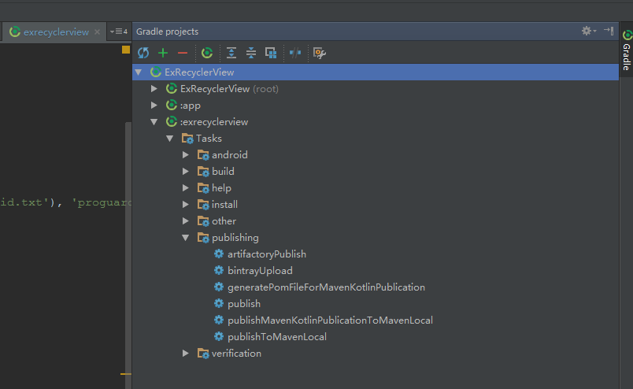

# Publish Kotlin / Java Library to MavenCentral/JCenter

This article use Android Studio & Gradle to publish Android Java/Kotlin library to MavenCentral/JCenter!
there is no actual operation for other IDE or pure Java library! but it still can be used as a reference!

I assume you have a [https://bintray.com] account!

## Java Library
Java library is simple to be published, and there have many tutorials on Internet!

Here is a java library of mine
[Example: XImageView](https://github.com/liungkejin/XImageView)

### First Step
copy `java-bintray.gradle` to your library directory(`/proj/lib/`),
and add this code to `/proj/lib/build.gradle` file.

```groovy
buildscript {
    repositories {
        mavenCentral()
        jcenter()
    }

    dependencies {
        classpath 'com.jfrog.bintray.gradle:gradle-bintray-plugin:1.6'
        classpath "org.jfrog.buildinfo:build-info-extractor-gradle:3.2.0"
    }
}

repositories {
    mavenCentral()
    jcenter()
}

apply from: 'java-bintray.gradle'
```

### Second Step
Add your bintray account info to `/proj/local.properties` file! (*remember ignore this file in your VCS*)

```
bintray.user=xxx
bintray.apikey=xxxxxxxxxxxxxxxxxxxxxxxxxxxxxxxxxxxxx
```

Add your library info to `/proj/gradle.properties` file!

```
PROJ_GROUP=cn.kejin.ximageview

PROJ_ARTIFACTID=XImageView

PROJ_VERSION=1.0.0
### The last gradle ref format is $PROJ_GROUP:$PROJ_ARTIFACTID:$PROJ_VERSION

PROJ_NAME=XImageView

PROJ_WEBSITEURL=https://github.com/liungkejin/XImageView

PROJ_ISSUETRACKERURL=https://github.com/liungkejin/XImageView/issues

PROJ_VCSURL=https://github.com/liungkejin/XImageView.git

PROJ_DESCRIPTION=Android View for display large image

DEVELOPER_ID=Kejin
DEVELOPER_NAME=Liang Ke Jin
DEVELOPER_EMAIL=liungkejin@gmail.com
```

### Third Step
And now, you can use gradle to publish your library to JFrog bintray!


First, click `publishMavenJavaPublicationMavenLocal` task, this task will generate `*-javadoc.jar`,` *-sources.jar`, `*-pom.xml`,`*.aar`,
if this task build success, then click `bintrayUpload` task, this task will publish you library to jfrog bintray site!

And if you want add your library to JCenter, you need login to Jfrog bintray, and click the `Add To JCenter` button,
send a request to JCenter!


Then after the library be approved by JCenter, you can use your library like this:

```groovy
compile 'cn.kejin.ximageview:XImageView:1.0.0'
```

## Kotlin Library
[Example: ExRecyclerView](https://github.com/liungkejin/ExRecyclerView)

Publish Kotlin Library will not smoothly like Java library! because you can't use Javadoc to generate doc for kotlin project!
Of curse you can not generate Javadoc and publish to Jfrog bintray success, but if you want add your library JCenter,
you need  \*-javadoc.jar and \*-sources.jar, Otherwise your can't be approved by JCenter

Unfortunately, The KDoc project has stalled, but Jetbrians developed [Dokka](https://github.com/Kotlin/dokka),
BUT...the `dokka-android-gradle-plugin` haven't released yet. so we can't use the gradle plugin, BUT...
dokka has a command tool: `dokka-fatjar.jar`, and I running this command use gradle! then package and publish! :)


### First Step
Download [dokka-fatjar-0.9.7.jar](https://github.com/Kotlin/dokka/releases/download/0.9.7/dokka-fatjar.jar),
you download the last version at [dokka project](https://github.com/Kotlin/dokka).

Then copy `dokka-fatjar.jar` and  `JDK tools.jar`(`C:\ProgramFile\Java\jdkx.x.x\lib\tools.jar`) to your library directory(`/proj/lib/`).
(the reason of copy `tools.jar` is dokka-fatjar.jar used the `com.sun.javadoc` package while your output format is javadoc,
    and your JAVA_CLASS_PATH maybe not included that path)

### Second Step
Copy `kotlin-bintray.gradle` to your library directory(`/proj/lib/`), and add this code to `build.gradle`

```groovy

buildscript {
    /**
     * the kotlin version
     */
    ext.kotlin_version = '1.0.1-2'

    repositories {
        mavenCentral()
        jcenter()
    }
    dependencies {
        classpath "org.jetbrains.kotlin:kotlin-gradle-plugin:$kotlin_version"

        classpath 'com.jfrog.bintray.gradle:gradle-bintray-plugin:1.2'
        classpath "org.jfrog.buildinfo:build-info-extractor-gradle:3.2.0"
    }
}
repositories {
    mavenCentral()
    jcenter()
}

apply from: 'kotlin-bintray.gradle'
```

### Third Step
Add your bintray account info to `/proj/local.properties` file! (*remember ignore this file in your VCS*)

```
bintray.user=xxx
bintray.apikey=xxxxxxxxxxxxxxxxxxxxxxxxxxxxxxxxxxxxx
```

Add your library info to `/proj/gradle.properties` file!

```groovy
PROJ_GROUP=cn.kejin.exrecyclerview

PROJ_ARTIFACTID=ExRecyclerView

PROJ_VERSION=1.0.0
### compile "$PROJ_GROUP:$PROJ_ARTIFACTID:$PROJ_VERSION"


PROJ_NAME=ExRecyclerView

PROJ_WEBSITEURL=https://github.com/liungkejin/ExRecyclerView

PROJ_ISSUETRACKERURL=https://github.com/liungkejin/ExRecyclerView/issues

PROJ_VCSURL=https://github.com/liungkejin/ExRecyclerView.git

PROJ_DESCRIPTION=Extended the android recycler view


DEVELOPER_ID=Kejin
DEVELOPER_NAME=Liang Ke Jin
DEVELOPER_EMAIL=liungkejin@gmail.com
```

### Forth Step



First, click `publishMavenKotlinPublicationMavenLocal` task, this task will generate `*-javadoc.jar`,` *-sources.jar`, `*-pom.xml`,`*.aar`,
if this task build success, then click `bintrayUpload` task, this task will publish you library to jfrog bintray site!

And if you want add your library to JCenter, you need login to Jfrog bintray, and click the `Add To JCenter` button,
send a request to JCenter!

```groovy
compile 'cn.kejin.exrecyclerview:exrecyclerview:1.0.0'
```
